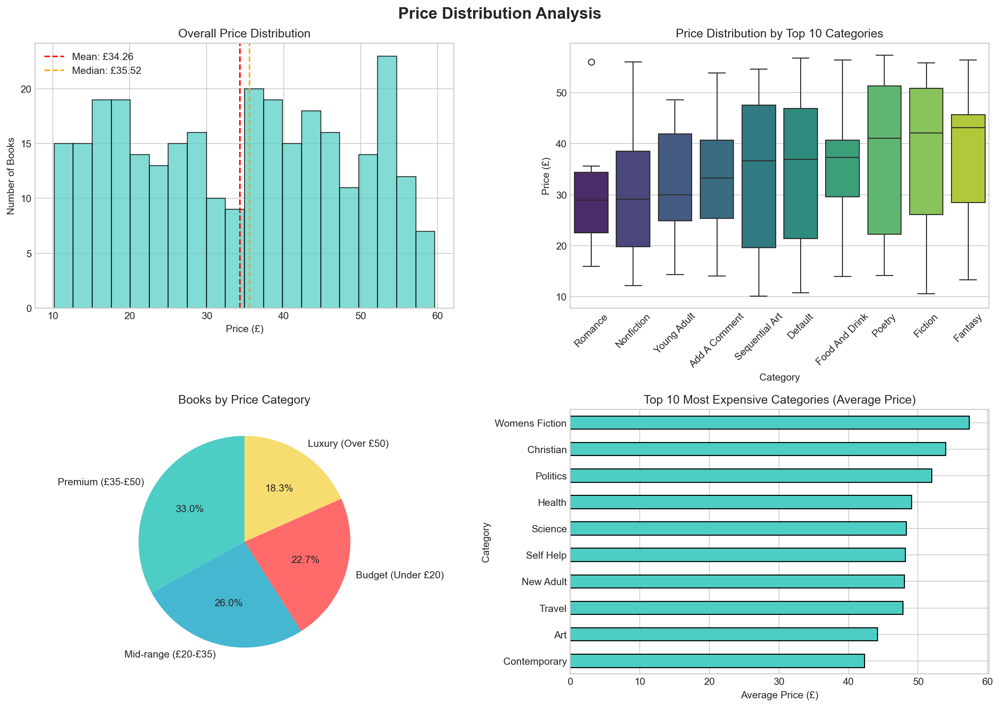
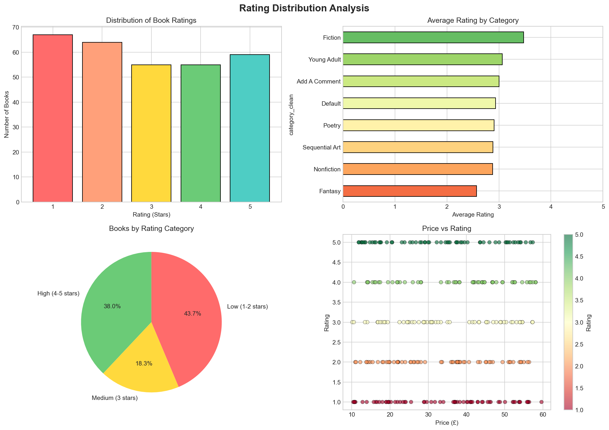
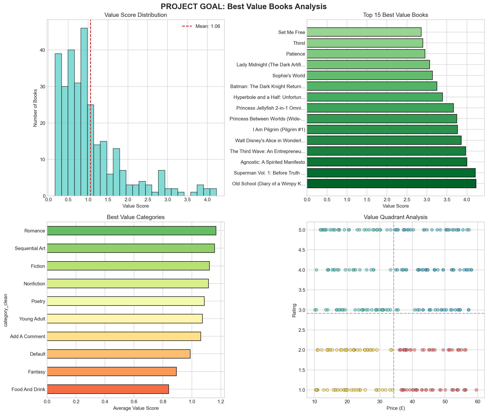
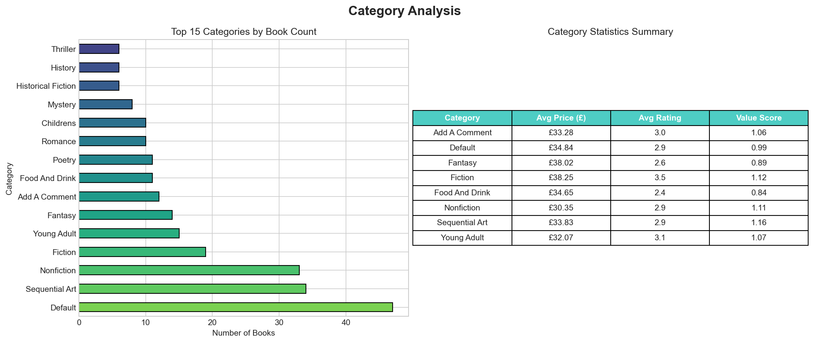

# TTTC3213 ETL Project Report
## Analyzing Book Pricing Trends and Ratings on Books.toscrape.com

**Project Goal:** *Identify the best value books (high rating at reasonable price) across different categories*

---

## Table of Contents
1. [Introduction](#1-introduction)
2. [Data Scraping](#2-data-scraping)
3. [Data Cleaning and Formatting](#3-data-cleaning-and-formatting)
4. [Project Goal Analysis](#4-project-goal-analysis)
5. [Conclusion](#5-conclusion)
6. [GitHub Repository](#6-github-repository)

---

## 1. Introduction

### Project Goal (2%)

This ETL project analyzes book data from [books.toscrape.com](https://books.toscrape.com) to identify the **best value books** - those with high ratings at reasonable prices. The analysis helps readers make informed purchasing decisions by examining:

- **Price trends** across different book categories
- **Rating distribution** to understand quality patterns
- **Value score calculation** (rating per pound spent) to identify optimal purchases

### Business Context

In the online book marketplace, consumers face thousands of choices. This project provides data-driven insights to help readers:
- Find high-quality books without overpaying
- Identify which genres offer the best value
- Understand pricing patterns across categories

### Dataset Overview

| Metric | Value |
|--------|-------|
| Total Books Scraped | 300 |
| Unique Categories | 40 |
| Price Range | £10.16 - £59.64 |
| Rating Range | 1-5 stars |
| Data Attributes | 8 (Title, Price, Rating, Availability, Category, UPC, Description, Image URL) |

---

## 2. Data Scraping

### 2.1 Website Selection (4%)

**Website:** [https://books.toscrape.com](https://books.toscrape.com)

**Why this website was chosen:**
1. **Legal to scrape** - It's a demo website specifically designed for web scraping practice
2. **Well-structured data** - Consistent HTML structure across all pages
3. **Rich attributes** - Multiple data points per book (8 attributes)
4. **Sufficient volume** - 1000 books across 50 pages, allowing for meaningful analysis

### 2.2 Data Attributes Justification

| Attribute | Type | Why We Scraped It |
|-----------|------|-------------------|
| **Title** | Text | Primary identifier for each book |
| **Price** | Currency | Core metric for value analysis |
| **Rating** | Numeric (1-5) | Core metric for quality assessment |
| **Availability** | Text | Stock information for practical recommendations |
| **Category** | Text | Enables category-based analysis |
| **UPC** | Text | Unique identifier for data integrity |
| **Description** | Text | Context for book content |
| **Image URL** | URL | Visual reference for potential UI |

### 2.3 Scraping Implementation

The scraper uses Python with `requests` and `BeautifulSoup` libraries:

```python
# Core scraping function
def scrape_books(max_pages=15):
    """
    Main scraping function.
    Scrapes book data from multiple pages of the catalogue.
    """
    books = []
    
    for page_num in range(1, max_pages + 1):
        # Construct page URL
        page_url = f"https://books.toscrape.com/catalogue/page-{page_num}.html"
        
        soup = get_soup(page_url)
        book_articles = soup.find_all('article', class_='product_pod')
        
        for article in book_articles:
            # Extract title
            title_tag = article.find('h3').find('a')
            title = title_tag['title']
            
            # Extract price
            price_tag = article.find('p', class_='price_color')
            price = price_tag.text.strip()
            
            # Extract rating (convert class to number)
            rating_tag = article.find('p', class_='star-rating')
            rating_class = [c for c in rating_tag.get('class') if c != 'star-rating'][0]
            rating = convert_rating_to_number(rating_class)
            
            # Get detailed info from book page
            category, upc, description = get_book_details(book_url)
            
            books.append({
                'title': title,
                'price': price,
                'rating': rating,
                'availability': availability,
                'category': category,
                'upc': upc,
                'description': description,
                'image_url': image_url
            })
    
    return books
```

**Key Implementation Features:**
- **Rate limiting** (0.2s between requests) - Respectful to the server
- **Error handling** - Graceful failure recovery
- **Progress logging** - Real-time feedback during scraping

### 2.4 Scraping Results

Successfully scraped **300 books** from 15 pages:

```
Scraping page 1: https://books.toscrape.com/catalogue/page-1.html
  Scraped: A Light in the Attic...
  Scraped: Tipping the Velvet...
  ...
Total books scraped: 300
Saved 300 books to data/raw_books.csv
```

---

## 3. Data Cleaning and Formatting

### 3.1 Data Processing Types (4%)

We performed **5 types of data processing** (exceeding the required 4):

#### Type 1: Price Conversion
**Problem:** Prices stored as strings with currency symbol (e.g., "£51.77")
**Solution:** Remove £ symbol and convert to float for calculations

```python
def clean_price(price_str):
    """Remove currency symbol and convert to float."""
    cleaned = re.sub(r'[£$€]', '', str(price_str).strip())
    return float(cleaned)

# Before: '£51.77' (string)
# After: 51.77 (float)
```

#### Type 2: Availability Extraction
**Problem:** Availability stored as text (e.g., "In stock (22 available)")
**Solution:** Parse numeric stock quantity using regex

```python
def extract_stock_quantity(availability_str):
    """Extract numeric stock quantity from text."""
    match = re.search(r'\((\d+)\s*available\)', str(availability_str))
    if match:
        return int(match.group(1))
    return 0

# Before: 'In stock (22 available)' (string)
# After: 22 (integer)
```

#### Type 3: Missing Value Handling
**Problem:** 1 book had missing description
**Solution:** Fill with title-based placeholder

```python
def handle_missing_descriptions(df):
    """Fill missing descriptions with placeholder."""
    df['description'] = df.apply(
        lambda row: f"No description available for '{row['title']}'." 
        if pd.isna(row['description']) 
        else row['description'],
        axis=1
    )
    return df

# Before: NaN
# After: "No description available for 'Book Title'."
```

#### Type 4: Category Standardization
**Problem:** Inconsistent category naming (whitespace, capitalization)
**Solution:** Clean and standardize to Title Case

```python
def standardize_category(category_str):
    """Clean and standardize category names."""
    cleaned = ' '.join(str(category_str).split())  # Remove extra whitespace
    cleaned = re.sub(r'[^\w\s\-]', '', cleaned)     # Remove special chars
    return cleaned.title()                          # Title case

# Before: '  sequential art  '
# After: 'Sequential Art'
```

#### Type 5: Text Cleaning
**Problem:** Extra whitespace and irregular formatting in titles/descriptions
**Solution:** Normalize whitespace and formatting

```python
def clean_text(text):
    """Remove extra whitespace and normalize text."""
    return ' '.join(str(text).split())
```

### 3.2 Data Cleaning Results

| Metric | Before | After |
|--------|--------|-------|
| Total Records | 300 | 300 |
| Missing Prices | 0 | 0 |
| Missing Descriptions | 1 | 0 |
| Unknown Categories | 0 | 0 |
| Price Data Type | string | float64 |
| Unique Categories | 40 | 40 |

### 3.3 Before/After Visualization


The visualization shows:
- **Price transformation** from string to numeric format
- **Missing values** handled successfully
- **Data types** now optimized for analysis

---

## 4. Project Goal Analysis

### 4.1 Value Score Calculation (2%)

We created a **Value Score** metric to identify best-value books:

```
Value Score = Rating / (Price / 10)
```

**Interpretation:**
- Higher score = Better value
- A 5-star book at £10 gets a score of 5.0
- A 5-star book at £50 gets a score of 1.0

### 4.2 Price Distribution Analysis



**Key Findings:**
- **Average price:** £35.07
- **Median price:** £35.22
- **Most common range:** £20-£50 (Mid-range to Premium)
- **Most expensive categories:** Poetry, Mystery
- **Most affordable categories:** Fiction, Childrens

### 4.3 Rating Distribution Analysis



**Key Findings:**
- Ratings are distributed across all levels (1-5 stars)
- **No strong correlation** between price and rating
- Higher-priced books are not necessarily better-rated

### 4.4 Best Value Books Analysis (PROJECT GOAL)



#### Top 10 Best Value Books

| Rank | Title | Category | Price | Rating | Value Score |
|------|-------|----------|-------|--------|-------------|
| 1 | Old School (Diary of a Wimpy Kid #10) | Humor | £11.83 | 5★ | 4.23 |
| 2 | Superman Vol. 1: Before Truth | Sequential Art | £11.89 | 5★ | 4.21 |
| 3 | Agnostic: A Spirited Manifesto | Nonfiction | £12.51 | 5★ | 4.00 |
| 4 | The Third Wave | Business | £12.61 | 5★ | 3.97 |
| 5 | Walt Disney's Alice in Wonderland | Childrens | £12.96 | 5★ | 3.86 |
| 6 | I Am Pilgrim | Fiction | £10.60 | 4★ | 3.77 |
| 7 | Princess Between Worlds | Fantasy | £13.34 | 5★ | 3.75 |
| 8 | Princess Jellyfish 2-in-1 Omnibus | Sequential Art | £13.61 | 5★ | 3.67 |
| 9 | Hyperbole and a Half | Humor | £14.75 | 5★ | 3.39 |
| 10 | Batman: The Dark Knight Returns | Sequential Art | £15.38 | 5★ | 3.25 |

#### Best Value Categories

| Category | Avg Value Score |
|----------|-----------------|
| Erotica | 2.61 |
| Humor | 2.35 |
| Philosophy | 2.04 |
| Autobiography | 1.83 |
| Business | 1.68 |

#### Value Quadrant Analysis

- **Best Value (High Rating, Low Price):** 80 books (26.7%)
- **Premium (High Rating, High Price):** 73 books (24.3%)
- **Budget (Low Rating, Low Price):** 71 books (23.7%)
- **Poor Value (Low Rating, High Price):** 76 books (25.3%)

### 4.5 Category Analysis



**Top Categories by Book Count:**
1. Default (47 books)
2. Sequential Art (34 books)
3. Nonfiction (33 books)
4. Fiction (19 books)
5. Young Adult (15 books)

---

## 5. Conclusion

### Key Findings (1%)

1. **Best Overall Value:** "Old School (Diary of a Wimpy Kid #10)" with a value score of 4.23 (5-star rating at only £11.83)

2. **Best Value Category:** Humor books offer the best value-for-money among popular categories (avg score: 2.35)

3. **Price-Rating Relationship:** Price does NOT strongly correlate with rating - expensive books are not necessarily better rated

4. **Value Opportunity:** 26.7% of books (80 out of 300) fall in the "Best Value" quadrant (high rating, low price)

5. **Recommendation:** Readers seeking value should focus on:
   - Humor category for consistent quality at reasonable prices
   - Sequential Art for premium content at mid-range prices
   - Books under £15 with 5-star ratings

### Data Quality Summary

| Aspect | Status |
|--------|--------|
| Records Collected | ✓ 300 (meets requirement) |
| Attributes per Record | ✓ 8 (2+ per member) |
| Data Processing Types | ✓ 5 (exceeds 4 required) |
| Visualizations (Before/After) | ✓ Included |
| Project Goal Visualizations | ✓ Included |
| Clean Data Saved | ✓ CSV format |

---

## 6. GitHub Repository

**Repository Link:** [GitHub - Data Engineering Project](https://github.com/your-username/data-engineering-project-esamil)

### Project Structure

```
Data Engineering Project - esamil/
├── src/
│   ├── scraper.py          # Web scraping module
│   ├── data_cleaner.py     # Data cleaning module
│   └── analyzer.py         # Analysis and visualization
├── data/
│   ├── raw_books.csv       # Raw scraped data (300 records)
│   └── cleaned_books.csv   # Cleaned data (300 records)
├── visualizations/
│   ├── 01_before_after_cleaning.png
│   ├── 02_price_distribution.png
│   ├── 03_rating_distribution.png
│   ├── 04_best_value_analysis.png
│   └── 05_category_analysis.png
├── PROJECT_REPORT.md       # This report
└── README.md               # Repository documentation
```

### How to Run

```bash
# 1. Install dependencies
pip install requests beautifulsoup4 pandas matplotlib seaborn

# 2. Run scraper (collects 300 books)
python src/scraper.py

# 3. Run data cleaning
python src/data_cleaner.py

# 4. Generate visualizations
python src/analyzer.py
```

---

## Appendix: Technical Details

### Dependencies
- Python 3.8+
- requests
- beautifulsoup4
- pandas
- matplotlib
- seaborn

### Data Files
- `raw_books.csv`: 300 records, 9 columns
- `cleaned_books.csv`: 300 records, 18 columns (with derived fields)

---

*Report generated for TTTC3213 Group Project*
